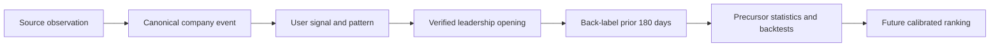

# Starting Monday Intelligence Scanner

## Business and Technical Brief

**Date:** July 26, 2026
**Purpose:** Describe what the intelligence scanner does today, how it works, which sources it uses, how often it runs, where it is limited, and what remains on the roadmap.

## Evidence standard

This brief reconciles executable code, source configuration, tests, and planning documents. The following labels are used throughout:

- **Implemented:** Present in the current repository and wired into an executable path.
- **Conditional:** Implemented, but dependent on a credential, company identifier, source availability, or production configuration not verified in this review.
- **Planned:** Described in an approved roadmap or source catalog, but not found as a completed product capability.
- **Legacy claim:** Present in an older requirement or roadmap document but contradicted or superseded by current code.

This is a repository-level assessment. It does not claim that every configured source is healthy in production or that every production environment variable is present.

---

## 1. Executive summary

Starting Monday's intelligence scanner is a background intelligence system for finding the conditions that precede senior leadership searches. It does two related jobs:

1. **Career-page job monitoring:** It checks tracked companies for public job postings, identifies plausible leadership roles, scores each role against the user's profile, detects newly posted matches, stores scan history, and can alert eligible users.
2. **Pre-search signal intelligence:** It collects company events from news, filings, press releases, executive-roster changes, funding data, regulatory calendars, WARN notices, and structured applicant-tracking systems. It classifies and deduplicates those events, correlates clusters into named patterns, and records whether those signals later preceded a verified leadership opening.

The strategic value is not simply finding a role after it is posted. The intended advantage is to identify a company-level mandate early enough for an executive to build a relevant relationship before a formal search becomes crowded.

The system is already more than a conventional job scraper. It contains a canonical company/event layer, multi-source corroboration, outcome labeling, precursor statistics, ATS opening history, a backtest harness, source health monitoring, dead-letter handling, and user-specific relevance scoring.

It is not yet a fully calibrated predictive product. Current pattern alerts are largely LLM judgments against a hand-authored pattern library. Watch/Warm/Hot probability bands, a grounded replacement for opportunity radar, anti-signals, dynamic learned patterns, event embeddings, and the agent-operated learning loop remain planned.

---

## 2. What the scanner is designed to answer

The system is designed to answer four progressively more valuable questions:

1. **Is this company publicly advertising a relevant leadership role?**
2. **What meaningful changes are occurring at this company now?**
3. **Do multiple changes form a recognizable pre-search pattern?**
4. **Historically, how often did this type of event or pattern precede a leadership opening?**

The first three questions are implemented. The fourth has an implemented data foundation and nightly statistics, but the calibrated probability has not yet been promoted into the user-facing product.

### Primary users

- Executives quietly monitoring target companies.
- Executives running an active search campaign.
- Coaches and outplacement professionals monitoring client target lists.
- Search firms and other future business customers that need mandate intelligence.

### Primary business outputs

- New matching leadership-role alerts.
- Company signals with evidence, dates, confidence, and source provenance.
- Multi-signal pattern alerts and an outreach angle.
- Daily briefing inputs and company intelligence views.
- Verified opening labels and precursor statistics used to improve future predictions.
- Administrative source, deduplication, labeling, and pipeline-health metrics.

---

## 3. The two scanner engines

### 3.1 Career-page and job-posting scanner

**Implemented.** The job scanner begins with companies in a user's watchlist. Each company may have a `career_page_url` and a user-specific `role_watch_description`.

For each eligible company, the worker:

1. Skips the company if it has a successful scan in the preceding 48 hours.
2. Checks `robots.txt` before accessing the career page.
3. Tries a structured ATS feed when the URL identifies a supported provider.
4. Otherwise performs a normal HTTP fetch with browser-like headers.
5. Escalates sparse or JavaScript-rendered pages to Browserless.
6. Extracts visible text from the response.
7. Uses deterministic title heuristics to identify up to 20 plausible roles.
8. Sends each candidate title to Claude Haiku for a 0-100 fit score against the user's target roles, target sectors, role type, and company-specific watch description.
9. Treats a score of 60 or greater as a match.
10. Compares titles with the preceding successful scan to identify new postings.
11. Stores one `scan_results` row containing status, titles, scores, summaries, and the highest match score.
12. Records newly detected leadership postings as verified role openings for the learning loop.

#### ATS paths used by the career scanner

| Provider | Structured adapter in the per-company scan | Notes |
|---|---:|---|
| Greenhouse | Yes | Public board JSON API |
| Lever | Yes | Public postings API |
| SmartRecruiters | Yes | Public company postings API |
| BambooHR | Yes | Public careers-list endpoint |
| Workday | Yes | Public CXS endpoint reconstructed from tenant and site |

If a structured feed fails or returns no jobs, the scanner falls back to page retrieval. Known SPA hosts are routed to Browserless when a plain fetch cannot produce enough visible text.

### 3.2 Company-signal intelligence engine

**Implemented.** The signal engine scans active and trialing users' tracked companies. It gathers evidence from multiple source families, uses Claude Haiku where classification is needed, and writes qualifying events to both a shared canonical event layer and a per-user signal projection.

For each company, it:

1. Builds company context including sector and public/private status.
2. Retrieves source records and recent articles.
3. Classifies unstructured records with Claude Haiku.
4. Requires a confidence of at least 60 for normal classified signals.
5. Extracts source kind, evidence snippets, focus tags, filing metadata, and partnership entities.
6. Resolves the user-owned company to a canonical company.
7. Merges likely duplicates into one `company_events` record.
8. Writes a user-visible `company_signals` projection linked to that event.
9. Reviews the preceding 60 days of signals for named multi-event patterns.
10. Sends selected executive-tier alerts and feeds signals into briefings and intelligence views.

Classification retries once on parse or model failure. Final failures are written to an ingestion dead-letter queue rather than silently discarded.

---

## 4. Current source inventory

### 4.1 Public news and company-controlled sources

| Source | Status | What it contributes | Important constraints |
|---|---|---|---|
| Google News RSS | Implemented | Recent company news involving funding, acquisitions, executives, expansion, layoffs, IPO activity, and products | Search and publisher coverage are incomplete; RSS can be noisy |
| GNews API | Conditional | Structured alternative to Google News RSS, up to eight recent articles per company | Used only when `GNEWS_API_KEY` is configured; commercial use requires the appropriate vendor tier |
| Company press rooms | Implemented | Company-authored announcements found on newsroom pages | Site structure and anti-bot controls vary |
| PR Newswire, Business Wire, GlobeNewswire | Implemented | Press releases discovered through news/RSS queries | Company-authored claims are not independent corroboration |
| Business Journals network | Implemented | Private and middle-market company coverage | Paywalls and indexing can limit detail |
| Technology trade press | Implemented | CIO, CTO, CISO, product, data, and transformation coverage | Publication coverage is uneven by sector |
| Regulatory calendar | Implemented | Curated sector deadlines and compliance-pressure events | It is a maintained rules source, not comprehensive regulatory monitoring |

### 4.2 SEC and public-record sources

| Source | Status | What it contributes | Important constraints |
|---|---|---|---|
| SEC EDGAR 8-K | Implemented | Executive changes, acquisitions, bankruptcy, restructuring, and material events | Public-company coverage only; entity resolution depends on CIK quality |
| SEC filing trend detection | Implemented | Patterns across indexed filings over time | A trend is an analytical inference, not proof of a search |
| DEF 14A proxy statements | Implemented | Board and officer composition changes | Annual cadence means changes can be detected late |
| Schedule 13D filings | Implemented | Activist investor entry | Public-company coverage only; checked on a throttled cadence |
| Form 4 filings | Implemented | Material open-market insider sales by officers | A sale has many possible explanations and is not a departure signal by itself |
| State WARN notices | Implemented | Material layoff and restructuring events | Default coverage is the ten configured states; matching depends on employer-name resolution |

The default WARN state set is California, Texas, Florida, New York, Pennsylvania, Illinois, Ohio, Georgia, North Carolina, and Michigan. It can be overridden by configuration.

### 4.3 Licensed and credential-dependent sources

| Source | Status | What it contributes | Activation condition |
|---|---|---|---|
| Crunchbase | Conditional | Structured funding rounds | Company must have a Crunchbase ID and `CRUNCHBASE_API_KEY` must be configured |
| People Data Labs | Conditional | Executive roster snapshots; inferred hires and departures from snapshot differences | `PDL_API_KEY` must be configured; no more than one snapshot per company per day |
| PredictLeads | Conditional | Executive changes and company event signals | Company URL and `PREDICTLEADS_API_KEY` required |

These integrations are present in code, but this brief does not verify production credentials, quotas, contract tier, or current provider health.

### 4.4 Structured ATS outcome source

**Implemented.** A separate daily ATS poller discovers and monitors public Greenhouse, Lever, and Ashby boards. It prioritizes user watchlists and then expands into a reference set of approximately 1,791 companies.

The poller:

- Reuses known boards on later runs.
- Probes company-name and domain-derived board tokens when no board is known.
- Limits probing to 40 companies per run by default.
- Tries a company no more than two times by default before marking the board unresolved.
- Stores leadership openings with stable URLs and open/closed dates.
- Marks postings as closed when they disappear from the feed.
- Sends each newly observed opening into the outcome-labeling system.

This poller currently captures the existence and duration of leadership openings. It does not yet compute job-posting velocity as a product signal.

---

## 5. Signal types and pattern detection

The canonical write path accepts these signal types:

- Funding, acquisition, expansion, layoffs, IPO, new product, and award.
- Executive departure and executive hire.
- Filing trend, board change, activist entry, and insider sale.
- Breach disclosure and regulatory change.
- Data platform, AI investment, and transformation budget.
- Partnership.
- Pattern alert.

### Pattern correlation

**Implemented, not calibrated.** After source ingestion, the system considers up to ten non-pattern signals from the preceding 60 days. At least two signals are required.

Claude Haiku compares the cluster with a hand-authored pattern library specific to CIO, CTO, CISO, COO, CPO, CDO, and VP Technology searches. Examples include:

- Leadership Transition Window.
- M&A Integration Mandate.
- Digital Transformation Mandate.
- Post-Incident CISO Search.
- CEO Transition.
- Engineering Buildout.
- Product Leadership Opening.

A detected pattern creates a weekly-deduplicated `pattern_alert`. For executive-tier users, selected patterns and executive departures can trigger an email containing a company-specific summary, outreach angle, and generated draft.

The current pattern mechanism should be understood as structured hypothesis generation, not a measured probability of a role opening.

---

## 6. Canonicalization, deduplication, and provenance

### Shared event layer

**Implemented.** User watchlists contain user-owned company rows, but the intelligence engine resolves them to shared `canonical_companies`. Source records are first represented as canonical `company_events`, then projected into each user's `company_signals`.

This design provides:

- Shared company identity across user watchlists.
- Cross-source event merging.
- Corroboration counts and source lists.
- Source URLs and source kinds.
- Content hashes, model version, evidence snippets, focus tags, and filing metadata.
- A stable event ID for linking outcomes and statistics.

### Deduplication behavior

The event layer looks for an event with the same canonical company and event type in a narrow date window, then applies normalized-summary similarity and conflict rules. A match is merged and its corroboration count is incremented when a genuinely new source is added.

The per-user layer also suppresses:

- The same source URL for the same user-owned company.
- A second projection pointing to the same canonical event.
- Repeated weekly pattern alerts through a synthetic pattern URL.

If canonical resolution or event storage fails, the system deliberately degrades to the legacy per-user write path. That protects delivery, but it can reintroduce duplicates and reduces shared provenance for the affected event.

---

## 7. Outcome labeling and the learning loop

**Implemented foundation.** The system records verified leadership openings from:

- New matches found by the career-page scanner.
- Greenhouse, Lever, and Ashby structured ATS feeds.
- Executive-hire events used as a proxy for searches that may never have been posted.
- User pipeline progress, with confidential/user-originated labels excluded from public statistics.
- DEF 14A officer differences.

When an opening is recorded, the system links the preceding 180 days of canonical company events to that opening and records the number of days from each event to the opening.

A nightly job computes 90-day precursor statistics by event type, sector, and role family. It:

- Counts only events whose full outcome window has elapsed.
- Excludes openings marked private or unsuitable for public statistics.
- Supports source quarantine for vendor-derived data.
- Uses Laplace smoothing to reduce extreme rates from small samples.

This is the beginning of a closed learning loop:

The final step, a user-facing calibrated rank or probability band based on these statistics, remains planned.

---

## 8. Schedules and effective frequency

All schedules below are UTC unless otherwise stated.

| Process | Executable schedule | Effective purpose |
|---|---|---|
| Main career-page scan | Monday, Wednesday, Friday at 08:00 | All eligible active/trialing users |
| Executive morning scan | Tuesday, Thursday, Saturday, Sunday at 08:00 | Executive tier only; main scan covers executive users on M/W/F |
| Executive evening scan | Daily at 20:00 | Intended second executive-tier scan |
| Company-signal ingestion | Monday, Wednesday, Friday at 08:30 | Runs after the morning career scan |
| WARN ingestion | Daily at 01:50 | Top-state layoff notices |
| ATS board poller | Daily at 02:15 | Leadership opening discovery and closure tracking |
| Canonical backfill | Daily at 02:40 | Clusters historical per-user signals into canonical events |
| Outcome-label backfill | Daily at 03:10 | Executive hire, pipeline, and proxy-diff labels |
| Precursor statistics | Daily at 03:40 | Recomputes closed-window 90-day statistics |
| Backtest cohort builder | Daily at 04:10 | Builds cases and matched controls |
| Pattern replay backtest | Sunday at 04:40 | Refreshes pattern precision metrics |
| Person-signal ingestion | Every four hours at minute 20 | Relationship intelligence, adjacent to company scanner |
| EDGAR freshness audit | Every six hours at minute 05 | Detects stale SEC ingestion |
| EDGAR watchdog | Hourly at minute 10 | Detects failure of the freshness audit itself |
| Ingestion DLQ monitor | Hourly at minute 25 | Alerts on accumulated or stale classifier failures |

### Important frequency discrepancies

1. **The evening executive scan is scheduled twice-daily in name, but successful scans are suppressed for 48 hours.** A company successfully scanned at 08:00 will normally be skipped at 20:00 and on the following day. The current effective successful-scan frequency is therefore closer to every 48 hours per company, not twice daily.
2. **The main scan code recognizes `campaign` as a daily tier, but the main scan cron only runs Monday, Wednesday, and Friday.** There is no separate non-M/W/F campaign scan in the current worker schedule.
3. **Older product requirements describe Monitor twice weekly, Active three times weekly, and Executive daily.** Current executable behavior is the authority and does not exactly match that tier table.
4. **Signal ingestion is three times weekly, not continuous.** A source may publish an event shortly after a run and remain undiscovered until the next M/W/F cycle unless another dedicated source job captures it.

These discrepancies should be resolved before scan cadence is used in pricing, service-level promises, or sales material.

---

## 9. Reliability and operational controls

### Implemented controls

- Postgres advisory locks prevent duplicate scheduled instances of major jobs.
- In-process job status prevents the same worker from starting the same named job twice.
- Career scans run with bounded concurrency: ten for the main scan and five for the executive scan.
- Transient network, DNS, and 502/503 scan errors receive one retry after three seconds.
- Non-recoverable scan failures are written to a dead-letter path.
- Signal-company failures enter a durable retry queue with up to five attempts.
- Signal ingestion is paginated and checkpointed so a later run can resume.
- The classifier retries once and writes final failures to an ingestion DLQ.
- The worker exposes health and per-job status through its health endpoint.
- Sentry captures unhandled job failures.
- Failure notifications are rate-limited to one per failure key per hour.
- Three consecutive empty career scans trigger an administrative warning.
- SEC freshness has both an audit and a watchdog.
- Source-run metrics record fetched, classified, written, merged, skipped, failed, latency, and token behavior where instrumented.

### Operational limits

- Main and executive career jobs have a ten-minute wrapper timeout; most other jobs default to five minutes.
- The signal job processes at most eight pages of 500 active users per scheduled run by default, then checkpoints.
- The signal loop pauses 600 milliseconds between companies and performs many sequential source calls, so large watchlists can exceed a single run's time budget.
- A timed-out promise does not necessarily cancel every underlying network or database operation; advisory locking reduces overlap, but cancellation is not end-to-end.
- Company scans are limited to 5,000 company rows in the main scan and 1,000 in the executive scan.
- The ATS poller examines 300 watchlist companies and 400 reference companies per run by default, with a 40-company discovery probe budget.

---

## 10. User-visible behavior

### Career-role results

Users can receive and view:

- Scan status: success, blocked, or error.
- Candidate titles and match status.
- A 0-100 AI fit score and one-sentence rationale.
- Whether a title is new relative to the preceding successful scan.
- Company-level scan history and last-checked time.

Executive scans send a role-fit alert when a new matching title appears. The alert path links the user back into Starting Monday.

### Company intelligence results

Signals carry:

- Event type and date.
- Concise summary and outreach angle.
- Source URL and source kind when available.
- Confidence, evidence snippets, focus tags, partner entities, and filing metadata.
- Canonical event linkage and corroboration.

The dashboard ranks signals using source confidence, freshness, role/persona relevance, evidence, and other quality factors. Daily briefings can incorporate new matches and company signals.

### What is not generated at scan time

Most outreach drafts are not generated for every signal during ingestion. They are generally generated on demand or for selected executive-tier alerts. This limits unnecessary model spending and prevents a large volume of unused copy.

---

## 11. Known limitations

### Coverage limitations

- The system only scans companies known to the watchlist or reference-company/ATS expansion path. It is not a complete census of employers.
- Private companies have fewer authoritative public records than SEC registrants.
- Company-name ambiguity can attach news or WARN notices to the wrong entity despite context and canonicalization safeguards.
- Career pages behind authentication, aggressive bot protection, or unsupported ATS structures may be inaccessible.
- `robots.txt`, HTTP 401/403/451 responses, and missing Browserless credentials deliberately stop or constrain scanning.
- Structured ATS adapters do not cover every ATS provider, custom career site, locale, pagination scheme, or subsidiary board.
- News and press sources have publication bias, indexing lag, duplicate syndication, and uneven geographic coverage.

### Detection and scoring limitations

- Career title detection is heuristic and stops after 20 candidates. Unusual titles or long page lines can be missed.
- Career scoring evaluates title and user context, not the full job description, compensation, reporting line, location constraints, or actual mandate.
- A score of 60 is model judgment, not an empirically calibrated probability.
- Title comparison is case-insensitive but otherwise simple; a renamed posting can appear new and materially changed descriptions can go unnoticed.
- The career result currently stores title-level findings but does not reliably preserve a direct job URL for every detected match.
- Pattern correlation requires at least two events, so a single severe event can fail to create a pattern alert.
- The hand-authored pattern library is prose interpreted by an LLM. It is not yet loaded from a versioned learned-pattern table.
- Company-signal confidence and career fit both use a 60 threshold, but they measure different things and should not be presented as the same score.

### Data-quality and learning limitations

- Canonical-layer failures deliberately fall back to per-user writes, which preserves availability but weakens deduplication.
- Outcome labels from posted roles overrepresent searches that become public. Retained and confidential searches are harder to observe.
- Executive-hire and pipeline labels reduce that bias but are proxies with their own uncertainty.
- A 90-day outcome window cannot support current statistics until the window has fully elapsed; this creates an unavoidable calibration lag.
- Sparse sector/role cells can remain statistically weak even with smoothing.
- Current user-facing language may imply prediction before enough backtest evidence exists. Externally published accuracy claims should remain gated.

### Commercial and legal limitations

- GNews requires the correct commercial tier for product use.
- Crunchbase, PredictLeads, PDL, and Apollo have retention, redistribution, derivative-data, attribution, or person-data considerations.
- Current counsel status is incomplete for several licensed sources.
- Raw calibration rates and source-derived datasets should not be exposed externally until rights and sample quality are reviewed.
- LinkedIn automation is intentionally excluded. The approved future path is user-seat CSV upload or alert forwarding, not automated scraping.

---

## 12. Implemented foundation versus unfinished roadmap

### Implemented or substantially implemented

- Classifier company context, retry, 512-token response budget, and ingestion DLQ.
- Central model registry for worker model selection.
- Source catalog with implementation and freshness fields.
- Canonical companies and canonical events.
- Rule-based cross-source event deduplication and corroboration.
- Per-user signal projections linked to canonical events.
- Source-run metrics and administrative health panels.
- Historical canonical backfill.
- Career-scan, ATS, executive-hire, pipeline, and proxy-derived outcome labels.
- Nightly precursor statistics.
- Greenhouse, Lever, and Ashby daily ATS polling.
- Ten-state WARN ingestion.
- User workflow to report a missed role.
- Backtest cohorts, matched controls, and weekly pattern replay.

The July 5 master plan still says execution was pending Phase 0. That header is stale relative to the current codebase.

### Planned or not yet promoted to a complete product capability

#### Calibrated product layer

- A calibrated score combining base rate, recency decay, corroboration, pattern strength, and user relevance.
- At least two weeks of shadow scoring before any user-facing switch.
- Watch/Warm/Hot bands with historical support, while keeping raw trade-secret rates private.
- A grounded opportunity radar whose reasons cite canonical events.
- Pre-positioned briefs and outreach drafts generated before high-priority notifications.
- Anti-signals such as hiring freezes, strong internal succession, or stable incumbent tenure.
- Full product-loop measurement from signal band to view, brief, outreach, dismissal, and outcome.

#### Learning system

- A versioned `signal_patterns` table replacing the hard-coded prose library.
- A weekly pattern-mining agent that proposes candidate sequences from labeled outcomes.
- A generalized source-health agent replacing source-specific monitoring.
- Weekly backtest automation with auto-demotion for materially degraded patterns.
- Monthly precision audits that re-fetch evidence and measure entity/summary accuracy.
- A discovery agent that clusters misses and proposes new sources.
- A weekly Intelligence Operations Brief.
- Apollo organization-level headcount differences, subject to contractual approval.
- Sales Navigator CSV and alert-forwarding ingestion through user-authorized workflows.
- Hiring-DNA views based on tenure, external/internal hiring, seasonality, and search-firm patterns.
- Event-history embeddings for similarity, radar, and matched-control selection.
- A formal trust-tier framework and cross-user firewall for unverified person data.

#### Longer-term flagship capabilities

- Earnings-call language-change analysis.
- Person-event cascade graphs.
- Search-process and retained-firm fingerprint forecasting.
- A Monte Carlo search simulator and timing optimizer.
- Macro-event hazard multipliers measured from outcomes.
- Public aggregate forecasting scorecards, only after stable evidence and legal review.

### Planned source expansion

The source catalog or strategy roadmap identifies these sources as future work or incomplete work:

- Earnings-call transcripts.
- Engineering blog posts.
- Job-posting velocity rather than opening detection alone.
- Public incident postmortems.
- Open-source project activity.
- Broader GDELT historical timelines.
- Wikidata executive career histories.
- Deeper Wayback reconstruction of historical career and leadership pages.
- ProPublica nonprofit executive data.
- OpenCorporates and Companies House director changes.
- USASpending contract changes.
- Patent activity and strategy-shift detection.
- Revelio Labs, BoardEx, and PitchBook only if scale and economics justify them.

---

## 13. Strategic interpretation

### What is defensible today

The defensible current claim is:

> Starting Monday monitors public company events and leadership openings across multiple source types, personalizes them to an executive's target role, and identifies evidence-backed patterns that may create an earlier relationship window.

The system can truthfully claim multi-source monitoring, role-fit scoring, structured ATS coverage, SEC event monitoring, deduplication, provenance, and an emerging outcome-learning loop.

### What should not yet be claimed

Avoid claiming that the product:

- Predicts leadership openings with a proven probability.
- Scans every target twice daily.
- Provides real-time or continuous monitoring across all sources.
- Has complete private-company or global coverage.
- Has validated accuracy or a specific lead-time advantage without current cohort evidence.
- Uses a self-learning model in production.
- Has every listed licensed source active in production.

### The potential moat

The durable advantage is not access to public news or job listings. Those inputs can be purchased or reproduced. The potential moat is the accumulated linkage between:

- Canonical company events.
- Source provenance and corroboration.
- Personalized role relevance.
- Verified leadership openings and hires.
- Days from precursor event to opening.
- Pattern performance by sector and role family.
- User action and eventual outcome.

If that dataset reaches sufficient size and quality, Starting Monday can rank relationship opportunities using observed outcomes rather than generic market intuition.

---

## 14. Recommended next business decisions

1. **Choose and publish one scan-cadence contract.** Align cron schedules, 48-hour suppression, product entitlements, pricing language, and support expectations.
2. **Treat Phase 3 evidence as the next gate.** Report current label count, sector coverage, pattern precision, false-positive rate, and median lead time before investing heavily in more sources.
3. **Keep prediction language behind the evidence gate.** Use “signal,” “pattern,” and “earlier relationship window” until calibrated bands pass shadow review.
4. **Prioritize source yield over source count.** Rank sources by unique qualifying events, opening-label lift, latency, failure rate, and cost per delivered signal.
5. **Fix direct-role evidence.** Persist stable role URLs, descriptions, first-seen/last-seen dates, and meaningful posting changes in the main user scan path.
6. **Separate independent corroboration from syndicated repetition.** A press release copied across several publications should not receive the same weight as an SEC filing plus an independent report.
7. **Complete vendor and privacy reviews before externalizing derived intelligence.** Keep quarantines and provenance enforceable at the event level.
8. **Replace the ungrounded opportunity radar before increasing its prominence.** Recommendations should cite stored canonical evidence.
9. **Update canonical documentation.** Mark completed master-plan tickets, retire contradicted requirements, and make this brief or a successor the business-facing source of truth.

---

## 15. Key implementation references

| Area | Primary repository reference |
|---|---|
| Worker schedules and health | `worker/index.js` |
| Main career scan orchestration | `worker/jobs/scan-job.js` |
| Executive scan and role alerts | `worker/jobs/executive-scan-job.js` |
| Per-company career scan | `worker/scanner/scan-company.js` |
| ATS adapters for user career scans | `worker/scanner/ats-adapters.js` |
| Page and Browserless retrieval | `worker/scanner/fetch-page.js` |
| Role candidate detection | `worker/scanner/detect-roles.js` |
| Claude role-fit scoring | `worker/scanner/score-hit.js` |
| Company-signal orchestration | `worker/jobs/signal-job.js` |
| Signal classification | `worker/signals/classify-signal.js` |
| Signal and canonical-event write path | `worker/signals/write-signal.js` |
| Cross-source event storage | `worker/signals/event-store.js` |
| Pattern library and correlation | `worker/signals/correlate-signals.js` |
| Daily ATS discovery and polling | `worker/jobs/ats-poller-job.js` |
| Greenhouse, Lever, Ashby fetchers | `worker/signals/fetch-ats-json.js` |
| WARN ingestion | `worker/jobs/warn-ingestion-job.js` |
| Outcome labeling | `worker/lib/outcome-labels.js` |
| Precursor statistics | `worker/jobs/precursor-stats-job.js` |
| Source catalog | `config/signal-source-catalog.json` |
| Approved phased roadmap | `docs/intelligence-scanner-master-plan-2026-07-05.md` |
| Broader intelligence roadmap | `docs/intelligence-roadmap.md` |
| Vendor derived-data review | `docs/vendor-tos-derived-data-audit-2026-07-05.md` |

---

## 16. Bottom line

The intelligence scanner is an operational multi-source company intelligence system with a job-posting detector at its edge and an outcome-learning architecture underneath it. Today it is strongest at collecting, organizing, personalizing, and correlating evidence. It has also begun assembling the labeled event history needed for prediction.

Its next strategic milestone is not adding another feed. It is proving, with closed-window outcomes and matched controls, that specific signals or patterns identify leadership openings earlier and more precisely than a reasonable baseline. That evidence should determine which sources, patterns, product claims, and business models deserve further investment.